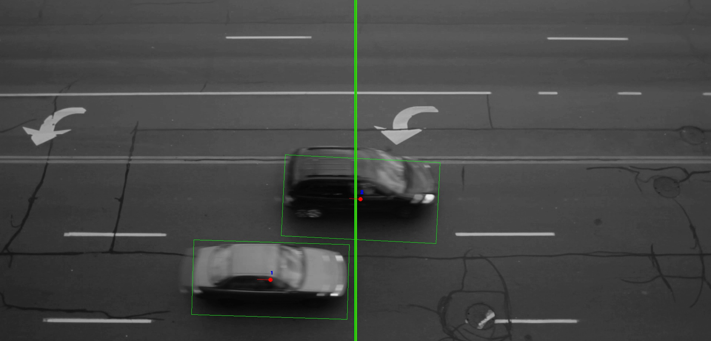
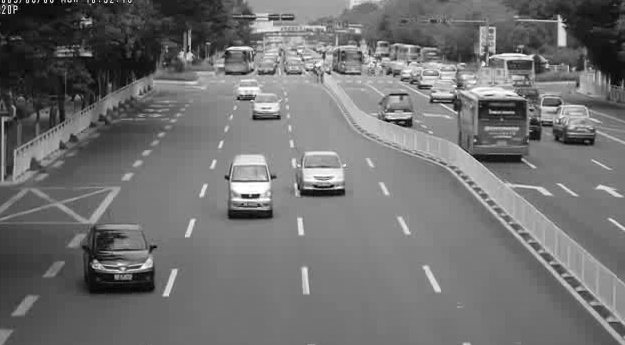
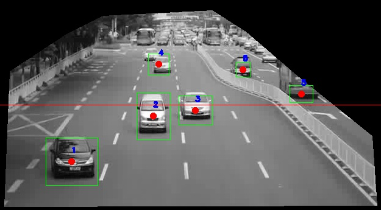

# Traffic Counter




This is the result of my undergraduate summer of research (2015) for the computer science department at Berea College. The OpenCV library is used to detect moving objects in a video feed by background subtraction and edge detection. 

No machine learning or fancy AI is being done here. This was mainly to keep the processing requirements low.

The system counts counts the number of cars passing the road. The project was developed on the original Raspberry Pi and therefore it needed to be fast to run. However, a faster device is recommended. 

The project was recently updated to use Python 3.8 and OpenCV 4.4.0.

You can check the paper report or the blog posts I made at the time to get a better idea about the motivation for the project.

## Interface
I have updated the project and moved away from the original script. In the new one, the computer vision parts are handled in a class TrafficCoutner in traffic_counter.py. To run the script, you must run main.py with a combination of parameters. For example:

```sh
python main.py -p <path_to_your_video> -d V 0.5 
```

The `-p` parameter indicates a path to the video to be analyzed. `-d` is to indicate direction and position of the counting line. A `V` parameter is for a vertical line, expecting that cars are moving horizontally. The float 0.5 after `V` is the position of the line in the screen.

There are other parameters that can be modified, but as of now, I have not included a way to change them once the script starts. 

Once the script runs, a frame from the video will be displayed and you can click on several points on the frame to select an area of interest to calculate. Everything outside the selected area will be ignored. To proceed to the next part, press `q` or `enter` on the keyboard.




## Blog Post

As part of the research requirements, I wrote blog posts describing the progress made each week. It can be found
at:

[blog series](https://andrescscresearch.wordpress.com/)

## Paper Draft

A paper report of the work is also included in the repository:


[PaperReport_traffic_counter.pdf](./PaperReport_traffic_counter.pdf)

## Other links
I will be posting Python videos to my YouTube channel, among other projects. If you are interested in checking it out, here is the link:

[Andres Berejnoi Channel](https://www.youtube.com/andresberejnoi)
